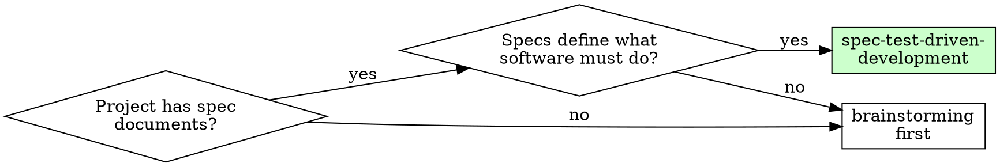
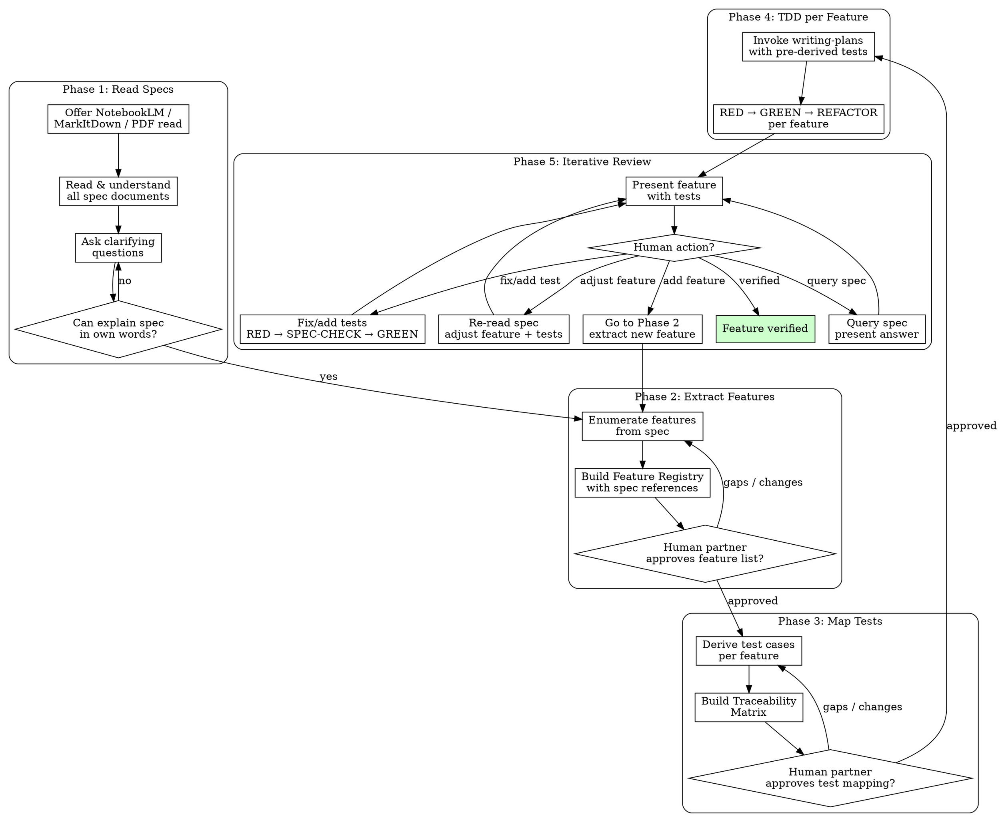

# Spec-Test-Driven Development

The spec is the golden rule. Features are extracted from specs. Tests are derived from features. Implementation follows tests.

Every feature traces back to the spec. Every test traces to a feature. No orphans.

**Announce at start:** "I'm using the spec-test-driven-development skill to extract features from specifications and derive tests before implementation."

<HARD-GATE>
Do NOT write any implementation code, invoke writing-plans, or begin TDD until:
1. Specs have been read and understood (Phase 1 complete)
2. ALL features are extracted and listed (Phase 2 complete)
3. Every feature has mapped test cases (Phase 3 complete)
4. Your human partner has approved the feature list and test mapping
This applies regardless of perceived simplicity.
</HARD-GATE>

## The Iron Laws

```
1. THE SPEC IS THE GOLDEN RULE — all features derive from it
2. NO IMPLEMENTATION WITHOUT FEATURE-TO-TEST MAPPING FIRST
3. EVERY FEATURE TRACES TO THE SPEC, EVERY TEST TRACES TO A FEATURE
```

Violating the letter of these rules is violating the spirit. No exceptions without your human partner's permission.

## When to Use



**Use when:**
- Project has PDF specs, reference documents, or standards it must conform to
- Features need to be systematically extracted from these specs
- Each feature needs traceable test coverage before implementation
- Your human partner needs to verify features against the spec

**Not for:**
- Projects without specifications (use brainstorming)
- Simple bug fixes or hotfixes (use TDD directly)
- Exploratory prototypes

## Checklist

You MUST create a task for each of these items and complete them in order:

1. **Read specifications** — use NotebookLM or MarkItDown to ingest spec documents
2. **Ask clarifying questions** — query the spec for ambiguities, ask your human partner
3. **Extract feature list** — enumerate every feature the repo provides, traced to spec sections
4. **Human partner approves feature list** — verify completeness against spec
5. **Map features to tests** — each feature → multiple test cases with acceptance criteria
6. **Human partner approves test mapping** — verify tests cover all spec requirements per feature
7. **Save feature-test document** — commit to `docs/superpowers/specs/YYYY-MM-DD-<project>-features.md` (user preferences for location override this default)
8. **Begin TDD per feature** — RED → SPEC-CHECK → GREEN → REFACTOR per test, inline
9. **Iterative review per feature** — human walks through each feature: verify, add tests, fix tests, adjust features, query spec

## Process Flow



## Phase 1: Specification Reading

Read and understand the spec documents before anything else.

**Offer optional tools:**

Check for available tools and offer them to your human partner:

- **NotebookLM** (if `notebooklm` skill is available): "I can query your NotebookLM notebooks for source-grounded answers about the specification. Would you like to use it?"
- **MarkItDown** (if installed — check via `which markitdown`): "I can convert your PDF specs to markdown for direct analysis. Would you like me to run `markitdown spec/your-file.pdf`?"
- **Native PDF reading**: Claude Code reads PDFs directly — use as fallback when neither tool is available
- **Human partner input**: Always ask your human partner about ambiguities or missing context

Tools are optional. Spec reading is not.

**Key activities:**

- Read all spec documents cover-to-cover (or query systematically)
- Identify the domain vocabulary and key concepts
- Note all "SHALL", "MUST", "WHEN...THEN" requirements
- Ask your human partner about ambiguities or contradictions
- Build a mental model of what the software must do

**Gate:** You can explain what the spec requires in your own words before proceeding. If you can't, keep reading.

## Phase 2: Feature Extraction

Systematically enumerate every discrete feature the repo provides or should provide. Read @feature-extraction-guide.md for the full methodology.

A feature is a single, testable capability — not a chapter, not a category, not a parameter. "Vector-vector addition" is a feature. "Arithmetic operations" is a category.

**Output — Feature Registry:**

```markdown
## Feature Registry

| ID | Feature Name | Spec Reference | Category | Status |
|----|-------------|----------------|----------|--------|
| F1 | [capability name] | [spec doc, section/page] | [group] | proposed |
| F2 | [capability name] | [spec doc, section/page] | [group] | proposed |
```

Each feature MUST have:
- **Unique ID** (F1, F2, ...) — stable across the project lifecycle
- **Clear name** describing the capability in domain terms
- **Spec reference** — document name + section or page number. No orphan features.
- **Category** for grouping related features
- **Status**: proposed → approved → tested → implemented → verified

**Gate:** Your human partner reviews and approves the complete feature list before proceeding. Ask:

> "Here is the complete feature list extracted from the spec. Please review — are there features missing? Any that don't belong? Any that should be split or merged?"

## Phase 3: Feature-to-Test Mapping

For each approved feature, derive test cases from the spec's requirements. Read @feature-test-mapping-guide.md for the full methodology.

**Output — Traceability Matrix:**

For each feature:

```markdown
### F1: [Feature Name]

**Spec ref:** [document, section/page]

**Acceptance criteria (from spec):**
- WHEN [condition] THEN [system] SHALL [behavior]
- IF [precondition] THEN [system] SHALL [behavior]
- ...

**Test cases:**

| Test ID | Test Name | What it verifies | Type |
|---------|-----------|-----------------|------|
| F1.T1 | test_[behavior]_[condition] | [specific assertion] | unit |
| F1.T2 | test_[behavior]_[edge_case] | [specific assertion] | unit |
| F1.T3 | test_[integration_scenario] | [end-to-end check] | integration |
```

**Rules:**
- Every feature has ≥1 test. Most have 3+: happy path, edge cases, error cases.
- Every test traces to exactly one feature.
- Test names describe behavior, not implementation.
- Include both unit and integration tests where appropriate.
- Write test skeletons with concrete assertions — not placeholders.

**Gate:** Your human partner reviews and approves the test mapping. Ask:

> "Here is the test mapping for all features. Each feature has tests derived from spec requirements. Please review — are tests missing for any requirement? Any tests that don't make sense?"

## Phase 4: TDD Implementation

For each feature in dependency order, implement using RED-GREEN-REFACTOR with the pre-derived tests from Phase 3. The TDD cycle runs inline — do NOT delegate to the standalone TDD skill, as doing so loses feature-to-test tracing context.

<HARD-GATE>
Before writing GREEN code for ANY test, you MUST re-read the relevant spec section for that feature. This is not optional. Use NotebookLM, MarkItDown, or direct PDF read — whichever was established in Phase 1. If you cannot confirm the spec says what you think it says, STOP and re-read.
</HARD-GATE>

### The Cycle: RED → SPEC-CHECK → GREEN → REFACTOR

For each test in the Traceability Matrix, in feature order:

**RED — Write failing test**
1. Take the next test skeleton from Phase 3 (e.g., F1.T1)
2. Write the test with concrete assertions — no placeholders
3. Run it. Confirm it **fails for the right reason** (feature missing, not typo/error)
4. If it passes immediately: you're testing existing behavior. Fix the test.
5. If it errors (not fails): fix the error, re-run until it fails correctly.

**SPEC-CHECK — Re-read the spec before implementing**
1. Re-read the spec section referenced by this feature (from the Feature Registry)
2. Confirm: does the test match what the spec actually requires?
3. If the spec says something different from what you assumed: fix the test first, re-run RED

**GREEN — Minimal code to pass**
1. Write the simplest code that makes the failing test pass
2. Do NOT add features, configuration, or "improvements" beyond what the test requires
3. Run the test. Confirm it **passes**.
4. Run ALL tests. Confirm nothing else broke.
5. If other tests fail: fix now, not later.

**REFACTOR — Clean up while green**
1. Remove duplication, improve names, extract helpers — only while all tests stay green
2. Do NOT add behavior. Do NOT change what the code does. Only change how it's organized.
3. Re-run all tests after refactoring. Still green? Move to next test.

### Per-Feature Commit

After all tests for a feature pass (F1.T1, F1.T2, ... all green):

```bash
git commit -m "feat(F1): implement [feature name]"
```

Update the Feature Registry: status `proposed` → `tested`.

### Planning for Larger Scope

**For larger scope (many features):** Invoke `writing-plans` to produce a detailed implementation plan. The plan receives the pre-derived tests, so each task already has its test skeletons. But the TDD cycle above still runs within each task — writing-plans structures the work, this cycle executes it.

```markdown
### Task N: Feature F1 — [Feature Name]

**Spec ref:** [document, section]
**Pre-derived tests:** F1.T1, F1.T2, F1.T3

- [ ] Step 1: Write test F1.T1 (from Phase 3 skeleton)
- [ ] Step 2: Run — verify RED
- [ ] Step 3: Re-read spec §X.Y — confirm test matches spec
- [ ] Step 4: Implement minimal code — verify GREEN
- [ ] Step 5: Write test F1.T2 (from Phase 3 skeleton)
- [ ] Step 6: Run — verify RED
- [ ] Step 7: Re-read spec §X.Y — confirm test matches spec
- [ ] Step 8: Implement — verify GREEN
- [ ] Step 9: Refactor
- [ ] Step 10: Commit "feat(F1): implement [feature name]"
```

The terminal state of Phase 4 per feature is: all pre-derived tests pass, spec re-read confirmed for each test, code is committed with feature ID reference.

## Phase 5: Iterative Review

A human-driven review loop. Walk through features one by one with the spec open. This phase can be long — that's expected. Do not rush it.

**For each feature, present:**

> "Feature F1 ([name]).
> Spec ref: §X.Y.
> Tests: F1.T1 [one-line summary], F1.T2 [one-line summary], F1.T3 [one-line summary].
> What would you like to do?"

**Human actions — classify by intent, not exact phrasing:**

Your human partner will not use these exact words. Classify what they say by whether it's about the **spec**, **features**, or **tests**, then loop back to the appropriate phase.

| Human intent | Loops back to | Then continues through | Returns to Phase 5 |
|-------------|--------------|----------------------|---------------------|
| Anything about the **spec** — query, clarify, re-read, "what does the spec say about...", "check section X", "I think the spec means..." | Phase 1 (re-read spec) | — | Resume at current feature |
| Anything about **features** — add, split, adjust, remove, rename, "this feature should...", "we're missing a feature for...", "this doesn't belong here" | Phase 2 (extract/modify registry) | → Phase 3 (map tests) → Phase 4 (TDD) | Re-present affected feature(s) |
| Anything about **tests** — add, fix, rewrite, remove, "this test is wrong", "need more coverage", "test doesn't match spec", "add edge case for..." | Phase 3 (re-derive/fix tests) | → Phase 4 (RED → SPEC-CHECK → GREEN) | Re-present current feature |
| Approve — "verified", "looks good", "next", thumbs up | — | — | Next feature |

**Rules:**
- After ANY change (test fix, new test, feature adjustment), re-run ALL tests before re-presenting the feature
- When human says a test is wrong, re-read the spec section FIRST — the human's understanding of the spec takes priority over yours
- When adding tests, follow the same RED → SPEC-CHECK → GREEN cycle from Phase 4 — no shortcuts
- When adjusting a feature, update the Feature Registry BEFORE changing code
- Spec queries do not count as "done reviewing" — after answering, return to the current feature

**Loop continues until all features in the registry are `verified`. No feature is complete until the human says so.**

## Constantly Consulting the Spec

<HARD-GATE>
The spec is NOT a one-time input. You MUST re-read the relevant spec section at each of these mandatory checkpoints:
1. **Before extracting each feature** — confirm the requirement exists in the spec
2. **Before deriving tests for a feature** — confirm edge cases and acceptance criteria from the spec
3. **Before writing GREEN code for each test** — confirm implementation direction matches spec (enforced in Phase 4 SPEC-CHECK step)
4. **Before presenting a feature for verification** — confirm the implementation matches the spec's stated requirement
Skipping any of these is a red flag. If you catch yourself saying "I already know what the spec says" — that's rationalization. Re-read it.
</HARD-GATE>

**How to re-read:**
- If NotebookLM is available, prefer it — source-grounded, citation-backed answers reduce hallucination risk
- If MarkItDown was used, the markdown version is available for direct re-reading
- Otherwise, use native PDF read on the specific section/page from the Feature Registry

**What to say when consulting the spec:**
- "Let me re-read spec §X.Y to confirm this feature's requirements before proceeding"
- "Checking the spec for edge cases on this behavior before deriving tests"
- "Re-reading spec §X.Y before implementing — confirming my test matches the requirement"

The spec is a living reference consulted at every decision point, not a Phase 1 artifact.

## Common Rationalizations

| Excuse | Reality |
|--------|---------|
| "I already understand the spec" | Understanding fades. Query the spec for every feature. |
| "This feature is obvious, no need to trace to spec" | Orphan features become orphan code. Every feature has a spec reference. |
| "One test per feature is enough" | One test = one happy path. Specs define edge cases too. |
| "I'll extract more features later" | Incomplete feature list = incomplete project. Extract ALL features first. |
| "The spec is ambiguous here" | Ask your human partner. Don't guess. |
| "NotebookLM/MarkItDown aren't available" | Read the PDF directly. Tools are optional, spec reading is not. |
| "Let me just start coding, I'll map tests after" | That's TDD without spec-derivation. Tests come from features come from specs. |
| "The feature list is too long" | That's how specs work. Prioritize with your human partner, but list them all. |
| "This test is too hard to write from spec alone" | Hard-to-test = unclear spec requirement. Clarify with your human partner first. |
| "I already know what tests to write" | Knowledge is not documentation. Derive from specs for traceability. |
| "Some requirements don't need tests" | If it's not testable, it's not a requirement. Remove or rewrite it. |
| "The spec is the brainstorming output, same thing" | Brainstorming produces a design. STDD derives testable features from authoritative spec documents. Different artifact. |

## Red Flags — STOP

- Implementation started without complete feature list
- Features without spec references (orphans)
- Tests without feature tracing
- Feature list not reviewed by human partner
- Spec not consulted during implementation
- "I'll add the remaining features later"
- Test mapping skipped for "simple" features
- Tests written AFTER implementation
- Traceability matrix has gaps
- "I'll map tests as I go"

**All of these mean: stop and go back to the appropriate phase.**

## Integration with Existing Skills

**Upstream (can invoke STDD):**
- `superpowers:brainstorming` — after producing a design, can transition to STDD for spec-driven test derivation

**Downstream (STDD invokes):**
- `superpowers:writing-plans` — Phase 4 for larger scope; receives pre-derived tests. writing-plans then offers subagent-driven-development or executing-plans as normal. The TDD cycle (RED → SPEC-CHECK → GREEN → REFACTOR) still runs inline within each task.

**Not invoked (by design):**
- `superpowers:test-driven-development` — STDD embeds its own TDD cycle with spec-check gates. Delegating to standalone TDD would lose feature-to-test tracing context. Use standalone TDD only for non-spec work (bug fixes, features without specs).

**Complementary:**
- `superpowers:verification-before-completion` — verify all spec-derived tests pass before claiming done

**Optional tools (soft references):**
- `notebooklm` skill — query knowledge bases for source-grounded spec answers
- `markitdown` CLI — convert PDF/Word/PowerPoint specs to markdown (`pip install 'markitdown[all]'`)

**Decision hierarchy for the agent:**
1. No idea / no specs → `brainstorming`
2. Have specs, need feature extraction + test derivation → **`spec-test-driven-development`**
3. Have specs + features + tests, need plan → `writing-plans`
4. Have plan, ready to execute → `subagent-driven-development` or `executing-plans`

## Verification Checklist

Before transitioning from Phase 3 to Phase 4:

- [ ] Every feature in registry has a spec reference
- [ ] Every feature has ≥1 test case
- [ ] Every test traces to exactly one feature
- [ ] No orphan features or orphan tests
- [ ] Test skeletons have concrete assertions (not placeholders)
- [ ] Human partner approved feature list
- [ ] Human partner approved test mapping
- [ ] Feature-test document saved and committed

Can't check all boxes? You're not ready for Phase 4. Fix the gaps first.
